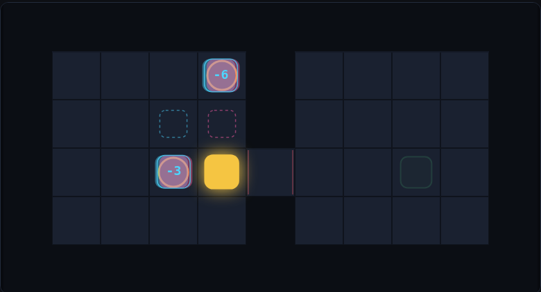

# ECHO SHIFT · 错位回声

一款**时间错位**网格解谜游戏。没有战斗，没有道具，没有随机——只有一条规则。

**▶ [在线试玩 · Play now](https://echo-shift-chi.vercel.app)**



## 唯一的规则

> **你走的每一步，会在 N 回合后由一个「回声」原样重演。**
> 回声是实体：它挡路，它踩得住压力板，它撞上你就是时间悖论。

由这一条规则推出的关键结论，也是整个游戏的核心：

> **你在压力板上站了几回合，那扇门就会在未来为你开几回合。**

所以每一关的问题都不是"怎么走过去"，而是**"我该在过去的哪个时刻、站在哪里、站多久"**。
你的移动同时是「行动」和「机关」——一个元素，两种职责。

## 玩法

| 操作 | 按键 |
| --- | --- |
| 移动 | `↑ ↓ ← →` / `WASD` |
| 原地等待一回合 | `空格` / `.` |
| 撤销 | `Z` / `U` / `Backspace` |
| 重来本关 | `R` |
| 切换关卡 | `[` `]` 或点击关卡号 |

手机上滑动屏幕移动，轻点为等待。

**看板**：实心暖色方块是「现在的你」；青/品红重影方块是「回声」，角标 `−3` 表示它落后你 3 回合；
虚线框是**回声下一步要去的格子**——所有悖论都是可以提前看见的，游戏不会阴你。

## 关卡

八关，每一关只教一件事：

| # | 关卡 | 回声延迟 | 最优步数 | 教什么 |
| --- | --- | --- | --- | --- |
| 1 | 回声 / Echo | −3 | 14 | 认识那个跟着你的东西 |
| 2 | 按住过去 / Hold the Past | −3 | 9 | 让过去的自己去踩板 |
| 3 | 站得久一点 / Linger | −3 | 8 | 停留时长 = 开门时长 |
| 4 | 回头路 / Backtrack | −5 | 17 | 一格宽的死路里，你必然撞上自己 |
| 5 | 恰好五步 / Exactly Five | −5 | 13 | 距离必须正好等于延迟 |
| 6 | 两个自己 / Two of You | −3 / −6 | 13 | 两块板，两个回声 |
| 7 | 拥挤 / Crowded | −3 / −6 | 15 | 既要踩准，又不能相撞 |
| 8 | 三重奏 / Trio | −2 / −4 / −6 | 12 | 三块板同时被踩住的那一瞬间 |

## 关卡是被证明过的，不是试出来的

`tools/solver.mjs` 是一个跑在**与游戏完全相同的规则引擎**上的广度优先求解器。
`npm test` 对每一关断言三件事：

1. **可解** —— 存在一条通关路线；
2. **最优步数正确** —— 表格里的步数由 BFS 重新算出，改动关卡后如果最优解变了，CI 直接失败；
3. **离开机制就无解** —— 把回声的延迟推到 10000 回合（等于没有回声）后，该关必须**变得无解**。

第 3 条是最重要的：它保证回声机制是**承重的**，而不是装饰。任何一关如果不用回声也能过，测试就红。

```
  #  level                    delay  optimal  echo-required   states   time
  --------------------------------------------------------------------------
  1  回声 / Echo                3      14       tutorial        117      2ms
  2  按住过去 / Hold the Past     3      9        yes             424      6ms
  3  站得久一点 / Linger           3      8        yes             434      2ms
  4  回头路 / Backtrack          5      17       yes             1002     3ms
  5  恰好五步 / Exactly Five      5      13       yes             25072    134ms
  6  两个自己 / Two of You        3/6    13       yes             37310    199ms
  7  拥挤 / Crowded             3/6    15       yes             56317    264ms
  8  三重奏 / Trio               2/4/6  12       yes             8243     34ms
```

## 本地运行

无需安装任何依赖。

```bash
npm run dev        # http://localhost:5173
npm test           # 验证全部关卡
npm run solve -- 8 # 打印第 8 关的最优解
```

## 自己加一关

在 `src/levels.js` 里加一个对象就行，然后 `npm test` 会告诉你它是否成立：

```js
{
  id: 9,
  title: '你的关卡',
  delays: [4],        // 一个回声，落后 4 回合；写 [3, 6] 就是两个
  par: 0,             // 先随便填，测试会告诉你真实的最优步数
  hint: '给玩家的一句话',
  grid: [
    '#########',
    '#@..#X..#',
    '#...g...#',
    '#.p.#...#',
    '#########',
  ],
}
```

图例：`#` 墙 · `.` 地板 · `@` 你 · `X` 出口 · `p` 压力板 · `g` 闸门。
闸门在**所有**压力板都被实体踩住时开启——所以 N 块板意味着你需要 N 个身体。

## 设计笔记

几个刻意的取舍：

- **回合制而非实时**。解谜的乐趣在于"想明白"，不在于"手速"。回合制还带来完全的确定性，
  这正是求解器能证明关卡的前提。
- **无限撤销**。悖论和失误的惩罚应该是零，玩家才敢去试探规则的边界。
- **只有 4 种元素**（墙、出口、压力板、闸门）。难度全部来自 `延迟` 和 `距离` 这两个数字的
  相互作用，而不是来自不断堆新机制。第 8 关和第 2 关用的是同一套东西。
- **闸门规则是全局的**（所有板 → 所有门），而不是一板一门。少一条规则，多一层组合。
- **回声不会挡住你的视线**：它下一步的位置永远画在屏幕上。信息完全公开，难的是推理，不是猜。

## 技术

原生 JavaScript + Canvas，ES Modules，零运行时依赖，零构建步骤。
`src/engine.js` 是纯函数、不碰 DOM——浏览器和求解器跑的是同一份代码。

## License

MIT
